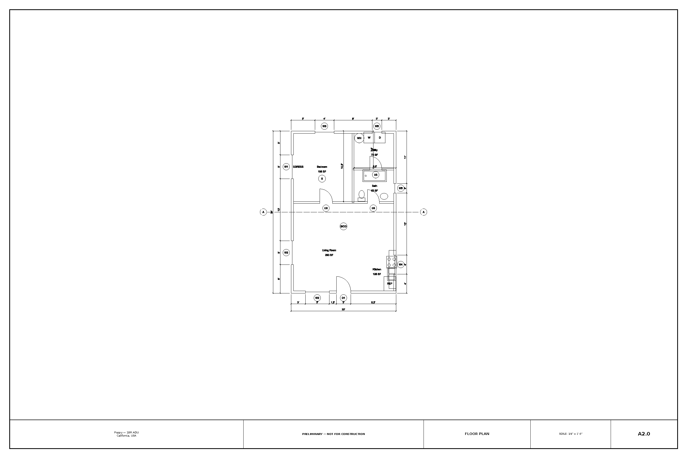
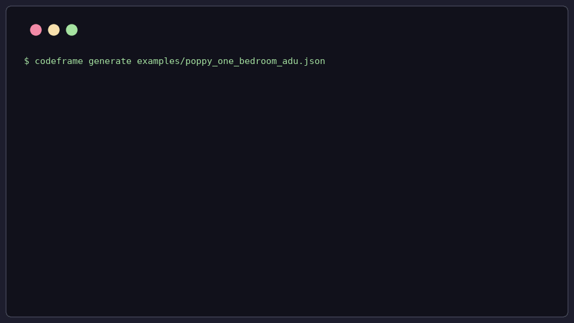
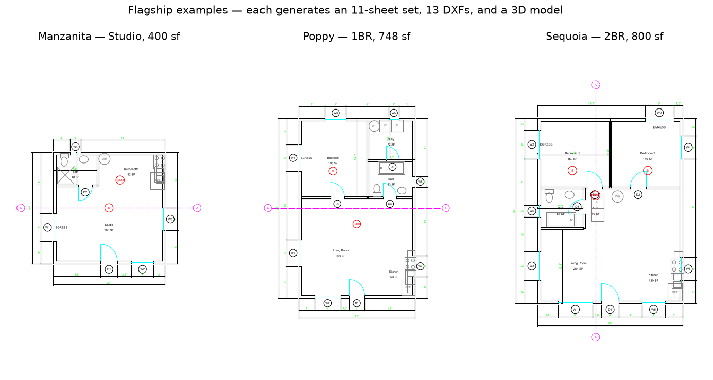

# CodeFrame

**An 11-sheet California ADU permit-drawing skeleton — from one JSON file
(or one guided conversation) to editable DXF, a title-blocked PDF set, and
a 3D model, in seconds.**

California counties publish free "pre-approved" ADU plans and describe
them, in their own words, as *approximately 85% complete* — the drafter
finishes and stamps. CodeFrame generates a skeleton with the **same sheet
index as those county standard plans** for *your* project's geometry:
deterministic, dimensioned, editable. You keep the judgment, the
liability, and the client.





## The sheet index

One command emits the sheet list a CA plan checker expects — the same
skeleton the LA / San Diego County pre-approved sets use:

| Sheet | Contents |
| --- | --- |
| A0.1 General Notes | Code references, drafting conventions, project data with lot coverage |
| A0.2 Code Compliance | Requirement vs. provided vs. status, computed from stated values (egress, ceiling height, smoke/CO, attic vent) |
| A1.0 Site Plan | Lot, setbacks, existing structures, placement dims, north arrow, graphic scale |
| A2.0 Floor Plan | Dimension chains, interior doors with swings, schedule tags, fixtures, smoke/CO symbols, egress callouts, room areas |
| A3.0 Elevations | All four, with roof lines, openings, height dims |
| A4.0 Roof Plan | Outline, ridge, slope callouts |
| A5.0 Schedules | Door and window schedules with deterministic marks, feet-inches sizes |
| A6.0 Sections | Transverse cuts keyed to the floor plan |
| S0.0 Structural Notes | Design basis, conventional-construction path (CRC R301.1.3) |
| S1.0 Foundation Plan | Slab-on-grade footings, hold-downs, anchor-bolt and vapor-retarder notes |
| S2.0 Roof Framing Plan | Rafter/truss layout with span arrow and callouts; deferred-submittal note for trusses |

Every DXF is editable model-space geometry on conventional layers; the PDF
is Arch D sheets with title blocks at true architectural scales; a STEP 3D
massing model rides along for owner communication. Every sheet is stamped
**PRELIMINARY — NOT FOR CONSTRUCTION**.

A complete generated set is committed at
[`examples/sample-output/poppy-1br/`](examples/sample-output/poppy-1br/) —
open the PDF and judge for yourself.

## Flagship examples



| Example | Program | Mirrors |
| --- | --- | --- |
| [`manzanita_studio_adu.json`](examples/manzanita_studio_adu.json) | 400 sf studio, rafter roof | Sacramento Shelf-Ready Studio scale |
| [`poppy_one_bedroom_adu.json`](examples/poppy_one_bedroom_adu.json) | 748 sf 1BR, trussed — sized under the 750 sf impact-fee threshold | San Jose pre-approved program scale |
| [`sequoia_two_bedroom_adu.json`](examples/sequoia_two_bedroom_adu.json) | 800 sf 2BR, egress in both bedrooms | LA County Standard Plan C scale |

```bash
python -m codeframe generate examples/poppy_one_bedroom_adu.json
```


## How it works

CodeFrame is two layers with a hard boundary (terms in
[`CONTEXT.md`](CONTEXT.md)):

- **Agent Layer** — a Claude Code skill that interviews you about the
  project, writes the Project Config, and runs generation. It never draws
  geometry.
- **Deterministic Core** — a plain Python package that turns a Project
  Config into drawings with **no AI involvement**. Same input,
  byte-identical output, pinned by golden tests. Runs standalone from the
  CLI.

The Project Config (one JSON file) is the single source of truth. Geometry
is always explicit — footprint, wall positions, opening offsets, hold-down
points, member sizes — never inferred, never auto-laid-out, never sized by
the tool. If a dimension isn't stated, CodeFrame won't invent it.
Corrections happen by editing the config and regenerating, so the drawings
and the record of intent never drift apart.

## Quick start

Requires Python 3.11+. FreeCAD is optional (enables the 3D model).

```bash
git clone https://github.com/vicenteliu/CodeFrame.git
cd CodeFrame
python -m pip install -e ".[dev]"

python -m codeframe validate examples/poppy_one_bedroom_adu.json
python -m codeframe generate examples/poppy_one_bedroom_adu.json
open outputs/poppy-1br/drawing_set.pdf
```

### Guided mode (Claude Code)

The interview workflow lives in `skills/codeframe-adu/`:

```bash
mkdir -p .claude/skills
ln -s ../../skills/codeframe-adu .claude/skills/codeframe-adu
claude   # then: "I need permit drawings for a backyard studio"
```

## Scope and limits (v1)

Deliberately narrow so that what it does generate is dependable:

- California detached ADUs and accessory structures — single story, wood
  frame, rectangular footprint, gable roofs.
- Structural sheets are prescriptive-path skeletons: all member and
  footing sizes are your inputs, drawn and annotated, never calculated.
  Braced-wall design, structural calcs, Title 24, and MEP stay with you
  and your consultants.
- Geometry checks only. The code-compliance sheet is arithmetic on stated
  values with CRC citations — useful triage, not an approval.

## Looking for pilot testers

CodeFrame is looking for **1–3 practicing California ADU drafters or
designers** to run it on a real project. You get the generated skeleton
and direct support; we get to find out where it saves you time and where
it falls short. Open a
[GitHub issue](https://github.com/vicenteliu/CodeFrame/issues) with a
sentence about your practice to get started.

## Development

```bash
pytest                      # full suite; FreeCAD-dependent tests skip if absent
UPDATE_GOLDEN=1 pytest      # bless intentional output changes
```

```text
CONTEXT.md            Ubiquitous language (canonical domain terms)
docs/                 Vision, architecture, roadmap, ADRs, research, disclaimer
examples/             Example Project Configs + a committed sample output set
skills/               Agent Layer (Claude Code skills)
src/codeframe/        Deterministic Core (Python package)
tests/                Test suite incl. golden DXF/PDF/STEP snapshots
```

Architecture decisions live in `docs/adr/`; the market/requirements survey
behind the sheet index is in
[`docs/research/2026-07-09-pilot-appeal-survey.md`](docs/research/2026-07-09-pilot-appeal-survey.md).

## Status, disclaimer, license

Pre-alpha, under active development. CodeFrame is not a licensed design
professional and its outputs are not permit sets or construction
documents — a qualified professional must review, complete, and take
responsibility for every drawing before any use. See
[`docs/disclaimer.md`](docs/disclaimer.md).

Source-available for evaluation; all rights reserved. If you want to use
CodeFrame commercially, open an issue and let's talk.
