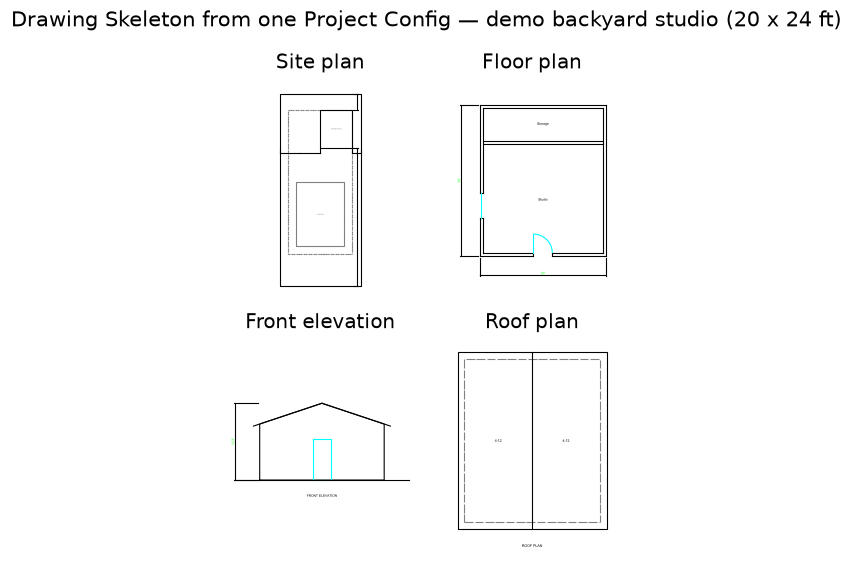
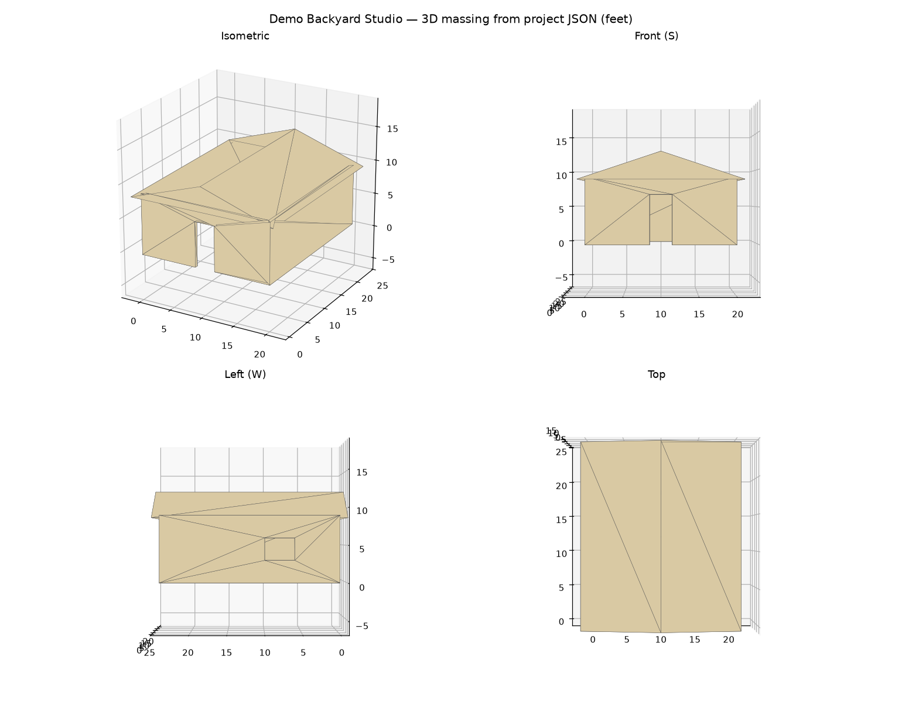

# CodeFrame

**Permit-drawing skeletons for California detached ADUs — from a guided
conversation to an editable DXF + PDF drawing set.**

CodeFrame is built for drafters, designers, and design-build firms who
prepare residential permit packages. Describe the project in a guided
[Claude Code](https://claude.com/claude-code) conversation (or write one
JSON file by hand), and CodeFrame generates a site plan, floor plan, four
elevations, and roof plan at 60–70% completeness — you finish, check, and
sign it in your own CAD tool. It drafts the boring 60%; you keep the
judgment, the liability, and the client.



## What you get

One command turns a Project Config into:

| File | Contents |
| --- | --- |
| `site_plan.dxf` | Lot, setbacks, existing structures, placement dimensions |
| `floor_plan.dxf` | Walls with openings, door swings, glazing, room labels, overall dims |
| `elevation_{front,rear,left,right}.dxf` | Wall faces, roof lines with overhangs, openings, grade line |
| `roof_plan.dxf` | Roof outline, ridge, walls below, slope callouts |
| `drawing_set.pdf` | The set composed on Arch D sheets with title blocks and standard scales |
| `model_3d.step` | Optional 3D massing model for owner communication (requires FreeCAD) |

Every DXF is editable model-space geometry on conventional layers
(`A-WALL`, `A-GLAZ`, `C-PROP-SBCK`, …), not flattened linework. Every sheet
is stamped **PRELIMINARY — NOT FOR CONSTRUCTION**.



## How it works

CodeFrame is two layers with a hard boundary (terms in
[`CONTEXT.md`](CONTEXT.md)):

- **Agent Layer** — a Claude Code skill that interviews you about the
  project, writes the Project Config, and runs generation. It never draws
  geometry.
- **Deterministic Core** — a plain Python package that turns a Project
  Config into drawings with **no AI involvement**. Same input, byte-identical
  output, pinned by golden tests. Runs standalone from the CLI.

The Project Config (one JSON file) is the single source of truth. Geometry
in it is always explicit — footprint, wall positions, opening offsets —
never inferred or auto-laid-out. If a dimension isn't stated, CodeFrame
won't invent it. Corrections happen by editing the config and regenerating,
so the drawings and the record of intent never drift apart.

```json
"building": {
  "position": { "x": 25, "y": 86 },
  "footprint": { "width": 20, "depth": 24 },
  "wall_height": 9,
  "exterior_wall_thickness": 0.5,
  "roof": { "type": "gable", "slope": "4:12", "ridge_axis": "y", "overhang": 1 }
}
```

## Quick start

Requires Python 3.11+. FreeCAD is optional (enables the 3D massing model).

```bash
git clone https://github.com/vicenteliu/CodeFrame.git
cd CodeFrame
python -m pip install -e ".[dev]"

python -m codeframe validate examples/demo_residential_project.json
python -m codeframe generate examples/demo_residential_project.json
open outputs/demo-backyard-studio/drawing_set.pdf
```

`validate` checks a Project Config and prints an actionable error list;
`generate` writes the full set to the config's `output_target` (or
`--out DIR`); `schema` prints the Project Config JSON Schema.

### Guided mode (Claude Code)

The interview workflow lives in `skills/codeframe-adu/`. Inside this repo:

```bash
mkdir -p .claude/skills
ln -s ../../skills/codeframe-adu .claude/skills/codeframe-adu
claude   # then: "I need permit drawings for a backyard studio"
```

The skill asks for the lot, setbacks, footprint, openings, and roof in
plain language, writes the config, validates, generates, and walks
corrections with you — without ever touching the geometry itself.

## Scope and limits (v1)

Deliberately narrow so that what it does generate is dependable:

- California detached ADUs and accessory structures only — single story,
  wood frame, rectangular footprint.
- Gable roofs only (shed and flat are validated but not drawn yet).
- No openings on interior walls, no attached ADUs, no multi-story.
- Geometry checks only (things must fit where the config puts them) — no
  zoning or code compliance checking. The site plan carries the placement
  dimensions a plan checker reads setbacks from; verifying them is your job.

## Looking for pilot testers

CodeFrame is looking for **1–3 practicing California ADU drafters or
designers** to run it on a real project. You get the generated skeleton and
direct support; we get to find out where it saves you time and where it
falls short. Open a
[GitHub issue](https://github.com/vicenteliu/CodeFrame/issues) with a
sentence about your practice to get started.

## Development

```bash
pytest                      # full suite; FreeCAD-dependent tests skip if absent
UPDATE_GOLDEN=1 pytest      # bless intentional output changes
```

```text
CONTEXT.md            Ubiquitous language (canonical domain terms)
docs/                 Vision, architecture, roadmap, ADRs, disclaimer
examples/             Example Project Config files
skills/               Agent Layer (Claude Code skills)
src/codeframe/        Deterministic Core (Python package)
tests/                Test suite incl. golden DXF/STEP snapshots
```

Architecture decisions are recorded in `docs/adr/` — why ezdxf over FreeCAD
for 2D (0001), why explicit geometry with no auto-layout (0002), and how the
optional FreeCAD massing model fits in (0003).

## Status, disclaimer, license

Pre-alpha, under active development. CodeFrame is not a licensed design
professional and its outputs are not permit sets or construction documents —
a qualified professional must review, complete, and take responsibility for
every drawing before any use. See [`docs/disclaimer.md`](docs/disclaimer.md).

Source-available for evaluation; all rights reserved. If you want to use
CodeFrame commercially, open an issue and let's talk.
